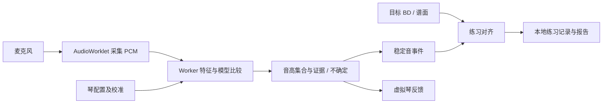

# 本地音频与识别架构

## 可行性判断

界面、BD 谱、练习记录和 PWA 都属于可分阶段实现的工程工作。真正需要实验的是：特定琴/麦克风条件下的弱邻孔检出率与单孔误报率。现有研究支持用谐波约束及音色模板分解复音，但不直接证明口琴串孔可以达到我们的指标。[Cheng 等，实时音乐分析与视奏评估](https://cseweb.ucsd.edu/~dhu/docs/icassp08_music.pdf)、[Vincent 等，谐波与非谐波 NMF](https://perso.telecom-paristech.fr/rbadeau/assets/icassp-08-bis.pdf)。以下算法是待验证的工程方案。

标准 Richter 的 2D 和 3B 同音，任何把单一频率直接映射到唯一 BD 的方案都有漏洞。[HOHNER FAQ](https://hohner.de/en/service/harmonica/faqs)。同音/八度/共用泛音、基频弱、气声、起音、颤音、压音、混响及浏览器音频处理都会影响判断。音频主要估计发声音高集合，孔位和吹吸是结合琴配置与上下文得到的推断。

## 逐层数据流

阶段 0A 仅实现采集、音量质量、样本及导出。随后离线重放与实时共享同一个纯 TypeScript DSP 核心，避免两个算法版本。先用 Vite + TypeScript 原生 UI，模块边界稳定后按实际复杂度决定是否引入 UI 框架。现阶段无需后端/账号/大型模型/WASM。

AudioWorklet 只做采集、缓冲和必要的轻量统计；后续 FFT/拟合放 Worker，UI 约 20–30 Hz 刷新。优先 transferable 缓冲队列而非一开始引入 SharedArrayBuffer 及其隔离部署条件。推断依据音频 sample index 计时，不能以渲染帧时间计音符。记录丢帧/队列延迟，过载宁可显示不确定。

麦克风请求关闭 echoCancellation、noiseSuppression、autoGainControl，并读取实际 settings。未知不等于已关闭。AudioWorklet 和麦克风部署需安全上下文，手机访问电脑 HTTP 局域网地址不等于 localhost。[MDN AudioWorklet](https://developer.mozilla.org/en-US/docs/Web/API/Web_Audio_API/Using_AudioWorklet)、[约束与实际设置](https://developer.mozilla.org/en-US/docs/Web/API/Media_Capture_and_Streams_API/Constraints)、[安全上下文](https://developer.mozilla.org/en-US/docs/Web/Security/Defenses/Secure_Contexts)。

## 第一轮算法，不走“多个峰 = 多个孔”

1. 采集原采样率 PCM；检测静音、饱和、突发噪声和音频中断，起音/收尾单独处理。不要先降噪再假定频谱未变。
2. 多分辨率 STFT 起点：48 kHz 下 2048/4096 点 Hann 窗、约 10–20 ms hop；其他采样率按实际时间尺度设置。长窗判谐波，短窗看起音。参数尚未验收。
3. 根据琴配置构建自然音字典；候选音允许适量音分偏移，偏移范围在验证集上选择，避免把压音强行归入自然音。
4. 同时拟合最佳单音假设 H1，以及同一吹吸方向的相邻双孔/三孔假设 H2/H3。全谱使用非负组合，泛音幅度允许受约束变化；不要把每个泛音都自由拟合到完美而失去辨识能力。
5. 比较加入邻孔后残差下降、复杂度惩罚、第二音独有谐波支持及跨帧持续性。H2 总能更好拟合，故“误差更小”本身不足以判串孔。
6. 输出 single-like / suspected-multiple / uncertain / invalid，以及音高候选、邻孔候选、相对证据、质量原因。未经真实标签校准的分数不能写成概率。
7. 最后加迟滞和稳态聚合。可探索 80–150 ms 持续门槛，但须与整体延迟一起实测，不能为稳定无限增加等待。

三条对照路线：A 单基频检测作负对照（只能衡量目标音命中）；B 解析谐波模板 + 受约束非负拟合；C 经审查的个人单孔录音模板 + NNLS/受约束 NMF。B/C 在相同留出录音上比较。若自然混吹与线性叠加差异大，再考虑真和弦模板或小型监督模型；不先花时间训练通用转录大模型。

目标 BD 只能参与后续对齐或明确标注的先验，不能让检测器“看见答案”。自由模式对单音保留同音候选；上下文模式也必须保留 acousticCandidates 与 inferredBD 的区别。

## 数据契约（阶段 0B 再落地）

- InstrumentProfile：schemaVersion、调、布局、每孔 B/D 对应 MIDI/标称频率、调律偏移、是否用户确认。不假定所有 10 孔都同一布局。
- Capture：id、sessionId、时间、sampleRate、样本数、设备/浏览器粗粒度信息、实际采集设置、琴配置快照、质量信息；避免不必要的设备标识。
- Label：intendedHoles、direction、intendedType、用户确定程度、reviewStatus、reviewedLabel。意图不能自动变成真值。
- FrameEvidence：sampleStart/end、candidatePitches、fitImprovement、quality、state、algorithmVersion。帧分数不直接成为演奏成绩。
- NoteEvent：时间范围、发声候选、稳定证据摘要、不可判定原因；PracticeAlignment 单独保存目标及对应事件。
- SessionSummary：指标分子/分母、不可判定占比、profileVersion、algorithmVersion。版本变化的分数不直接混为长期趋势。

## Local-first 与生命周期

默认本地处理，无上传录音、遥测、外部模型请求或 CDN 运行依赖。阶段 0A 音频仅在内存，主动导出后才成为用户文件；刷新会丢失，界面明确说明。后续记录用 IndexedDB；默认存事件和汇总，保存原始录音需用户显式选择，并可删除/导出。

开始采集要用户手势；停止/页面离开要释放所有 track、AudioContext 和节点；权限等待期间的取消不能稍后偷偷开启；播放样本与麦克风互斥。切后台/系统中断后不默认连续计分，恢复时提示重新开始。PWA 缓存只缓存应用外壳，不把音频塞进 Cache Storage；升级时避免旧 worklet 与新算法混用。

2026-09-14 用户要求 GitHub 托管及自行部署 PWA，故安装外壳提前：生产构建包含 manifest、图标和静态资源预缓存，开发模式不注册 Service Worker。部署平台使用 `npm ci`、`npm run build`，发布 `dist`。仓库保持私有，手机访问由用户选择的 HTTPS 部署提供；录音仍仅内存保存。

后续用户明确同意仓库公开，现由 GitHub Pages 持续部署。歌曲数据架构另见 [NOTE_SEQUENCE.md](NOTE_SEQUENCE.md)：来源适配器 → 与乐器无关的 NoteSequence → 依赖具体琴配置的 FingeringPlan → 谱面/跟练消费者。原歌曲、显式移调参数和指法候选分别保存；导入诊断与音频识别置信度互不混用。
